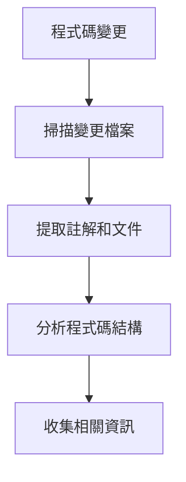
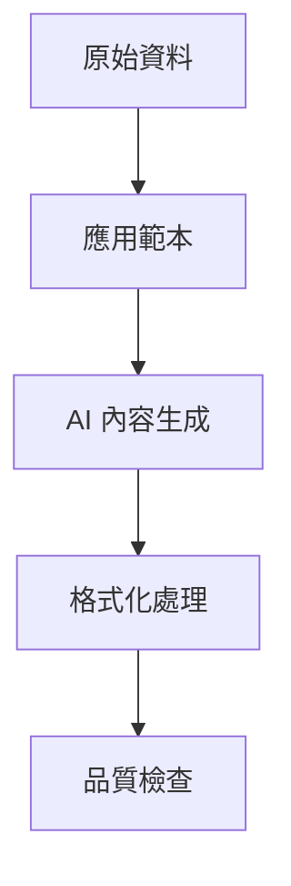
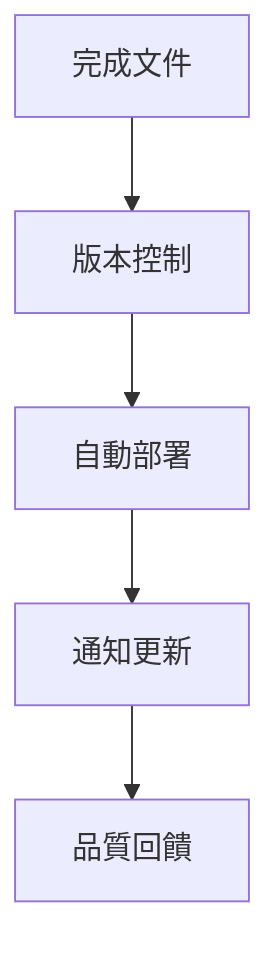

# 自動化文件產生工作流程

## 概述

本文件說明如何建立和維護自動化文件產生系統，以提升專案文件的品質和維護效率。

## 工作流程架構

### 1. 觸發機制
- **程式碼變更觸發**：當關鍵程式碼檔案更新時自動產生文件
- **排程觸發**：定期檢查並更新過時文件
- **手動觸發**：提供手動執行文件更新的機制

### 2. 文件分類

#### 技術文件
- API 文件
- 元件說明文件
- 系統架構文件
- 設定和部署指南

#### 使用者文件
- 使用者操作手冊
- 功能說明文件
- 常見問題解答
- 疑難排解指南

#### 開發文件
- 開發環境設定
- 編碼規範
- 測試指南
- 發布流程

### 3. 自動化流程

#### 階段一：內容收集


#### 階段二：內容處理


#### 階段三：文件發布


## 實作指南

### 1. 環境設定

#### 必要工具
- Node.js (>= 16.0)
- Git hooks
- Markdown 處理器
- AI API 整合（如 OpenAI, Claude 等）

#### 建議的技術堆疊
```bash
# 文件生成工具
npm install --save-dev @docusaurus/core
npm install --save-dev markdown-it
npm install --save-dev jsdoc

# AI 整合
npm install openai
npm install @anthropic-ai/sdk

# 自動化工具
npm install --save-dev husky
npm install --save-dev lint-staged
```

### 2. 文件範本系統

#### 範本結構
```
docs/templates/
├── api-template.md
├── component-template.md
├── user-guide-template.md
└── README-template.md
```

#### 範本變數
```markdown
# {{COMPONENT_NAME}} 說明文件

## 概述
{{COMPONENT_DESCRIPTION}}

## 使用方法
{{USAGE_EXAMPLES}}

## API 參考
{{API_REFERENCE}}

## 注意事項
{{NOTES_AND_WARNINGS}}

## 相關連結
{{RELATED_LINKS}}
```

### 3. AI 整合配置

#### Prompt 設定
```javascript
const documentationPrompt = `
role: AI

請根據以下程式碼和資訊產生技術文件：

## 程式碼內容
{codeContent}

## 文件類型
{documentType}

## 要求
- 使用繁體中文
- 包含使用範例
- 提供清楚的 API 說明
- 包含注意事項和最佳實踐

## 輸出格式
請使用 Markdown 格式，並遵循以下結構：
1. 概述
2. 功能說明
3. 使用方法
4. API 參考
5. 範例程式碼
6. 注意事項
`;
```

#### API 呼叫範例
```javascript
async function generateDocumentation(codeContent, documentType) {
  const prompt = documentationPrompt
    .replace('{codeContent}', codeContent)
    .replace('{documentType}', documentType);
    
  const response = await openai.chat.completions.create({
    model: "gpt-4",
    messages: [{ role: "user", content: prompt }],
    temperature: 0.3
  });
  
  return response.choices[0].message.content;
}
```

### 4. Git Hooks 整合

#### Pre-commit Hook
```bash
#!/bin/sh
# .husky/pre-commit

# 檢查是否有需要更新文件的檔案
if git diff --cached --name-only | grep -E '\.(js|jsx|ts|tsx|vue)$'; then
  echo "偵測到程式碼變更，準備更新文件..."
  npm run docs:update
fi
```

#### Post-merge Hook
```bash
#!/bin/sh
# .husky/post-merge

# 合併後自動更新文件
echo "合併完成，檢查文件更新..."
npm run docs:check-update
```

### 5. 自動化腳本

#### package.json 設定
```json
{
  "scripts": {
    "docs:generate": "node scripts/generate-docs.js",
    "docs:update": "node scripts/update-docs.js",
    "docs:check-update": "node scripts/check-docs-update.js",
    "docs:serve": "docusaurus start",
    "docs:build": "docusaurus build",
    "docs:deploy": "docusaurus deploy"
  }
}
```

#### 文件生成腳本範例
```javascript
// scripts/generate-docs.js
const fs = require('fs');
const path = require('path');
const { generateDocumentation } = require('./ai-helper');

async function generateComponentDocs(componentPath) {
  const codeContent = fs.readFileSync(componentPath, 'utf8');
  const componentName = path.basename(componentPath, '.jsx');
  
  const documentation = await generateDocumentation(
    codeContent, 
    'component'
  );
  
  const outputPath = `docs/components/${componentName}.md`;
  fs.writeFileSync(outputPath, documentation);
  
  console.log(`✅ 已生成 ${componentName} 的文件`);
}

// 執行文件生成
generateComponentDocs('./src/components/CanvasSection1.jsx');
```

## 品質控制

### 1. 自動檢查
- 文件完整性檢查
- 連結有效性驗證
- 程式碼範例語法檢查
- 拼字和語法檢查

### 2. 人工審查
- 內容準確性確認
- 使用者友善度評估
- 技術深度適當性
- 更新頻率評估

### 3. 持續改善
- 收集使用者回饋
- 監控文件使用情況
- 定期檢討和優化
- 更新 AI prompt 和範本

## 部署配置

### 1. GitHub Actions 整合
```yaml
# .github/workflows/docs.yml
name: Documentation Update

on:
  push:
    branches: [ main ]
    paths: [ 'src/**', 'docs/**' ]

jobs:
  update-docs:
    runs-on: ubuntu-latest
    steps:
      - uses: actions/checkout@v3
      - uses: actions/setup-node@v3
        with:
          node-version: '16'
      - run: npm install
      - run: npm run docs:update
      - name: Commit updated docs
        run: |
          git config --local user.email "action@github.com"
          git config --local user.name "GitHub Action"
          git add docs/
          git commit -m "Auto-update documentation" || exit 0
          git push
```

### 2. 文件網站部署
```yaml
# .github/workflows/docs-deploy.yml
name: Deploy Documentation

on:
  push:
    branches: [ main ]
    paths: [ 'docs/**' ]

jobs:
  deploy:
    runs-on: ubuntu-latest
    steps:
      - uses: actions/checkout@v3
      - uses: actions/setup-node@v3
      - run: npm install
      - run: npm run docs:build
      - uses: peaceiris/actions-gh-pages@v3
        with:
          github_token: ${{ secrets.GITHUB_TOKEN }}
          publish_dir: ./docs/build
```

## 監控和維護

### 1. 效能監控
- 文件生成時間
- API 呼叫成本
- 錯誤率統計
- 使用者滿意度

### 2. 定期維護
- 每週檢查過時文件
- 每月更新 AI prompt
- 每季評估整體效果
- 年度系統架構檢討

### 3. 故障恢復
- 備份策略
- 錯誤處理機制
- 人工介入流程
- 系統回復程序

## 成功指標

### 量化指標
- 文件覆蓋率 > 80%
- 文件更新延遲 < 24 小時
- 使用者滿意度 > 4.0/5.0
- 維護成本降低 > 50%

### 質化指標
- 開發團隊採用度
- 文件使用頻率
- 錯誤回報減少
- 新人上手速度

## 相關資源

- [AI Team Role Prompt Library](./README.md)
- [Prompt 設計指南](./prompt-design-guide.md)
- [專案開發規範](../../README.md)
- [GitHub Actions 文件](https://docs.github.com/actions)